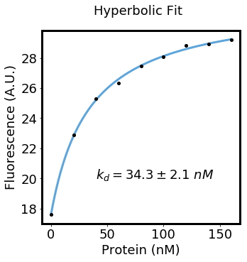
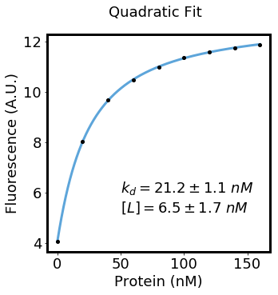

# Biofits

[](https://travis-ci.org/jimrybarski/biofits)

This library provides functions to fit equilibrium binding data using non-linear regression.
It's effectively just a wrapper around SciPy's `curve_fit` function. You need to know what you're doing though,
biofits won't prevent you from using the wrong equation or misinterpreting the data (for now).

# Installation

#### Install dependencies:  
`pip install numpy && pip install scipy`  
`pip install matplotlib` (optional)  

#### Install biofits:  
`pip install biofits`

# Examples

### Hyperbolic Fit
```python
from biofits import fit_hyperbola, hyperbola
import numpy as np
import matplotlib.pyplot as plt

# some example real-world data
concentrations = np.array([0, 20, 40, 60, 80, 100, 120, 140, 160])
fluorescence = np.array([17.59393811, 22.8988294, 25.30156157, 26.33397056, 27.44683102, 28.07189301, 28.83145338, 28.89926584, 29.22217763])

# perform the fit
yint, yint_stddev, delta_y, delta_y_stddev, kd, kd_stddev = fit_hyperbola(concentrations, fluorescence)

# create the fit curve, just for plotting
x = np.linspace(min(concentrations), max(concentrations), len(concentrations)*1000)
y = hyperbola(x, yint, delta_y, kd)

# plot the results
plt.figure(figsize=(5,5))
plt.plot(x,y, label='fit', zorder=0)
plt.plot(concentrations, fluorescence, 'o', label='data', color='black', markersize=4)
text = plt.text(40, 20, "$k_{d}=%.1f \pm %.1f\ nM$" % (kd, kd_stddev), fontsize=18)
plt.xlabel("Protein (nM)", fontsize=18)
plt.ylabel("Fluorescence (A.U.)", fontsize=18)
```


### Quadratic Fit

Here we titrate a protein at various concentrations with a constant (unknown) concentration of ligand.

```python
from biofits import fit_quadratic, quadratic
import numpy as np
import matplotlib.pyplot as plt

# some example real-world data
concentrations = np.array([0, 20, 40, 60, 80, 100, 120, 140, 160])
fluorescence = np.array([4.04057221945, 8.02206664679, 9.68169248317, 10.4687043773, 10.9989947842, 11.3576978629, 11.6021191924, 11.7486026869, 11.8934660043])

# perform the fit
yint, yint_stddev, delta_y, delta_y_stddev, kd, kd_stddev, constant, constant_stddev = fit_quadratic(concentrations, fluorescence)

# create the fit curve, just for plotting
x = np.linspace(min(concentrations), max(concentrations), len(concentrations)*1000)
y = quadratic(x, yint, delta_y, kd, constant)

# plot the results
plt.figure(figsize=(5,5))
plt.plot(x,y, label='fit', zorder=0)
plt.plot(concentrations, fluorescence, 'o', label='data', color='black', markersize=4)
plt.text(50, 6, "$k_{d}=%.1f \pm %.1f\ nM$" % (kd, kd_stddev), fontsize=18)
plt.text(50, 5.2, "$[L]=%.1f \pm %.1f\ nM$" % (constant, constant_stddev), fontsize=18)
plt.suptitle("Quadratic Fit", fontsize=18)
plt.xlabel("Protein (nM)", fontsize=18)
plt.ylabel("Fluorescence (A.U.)", fontsize=18)
```

